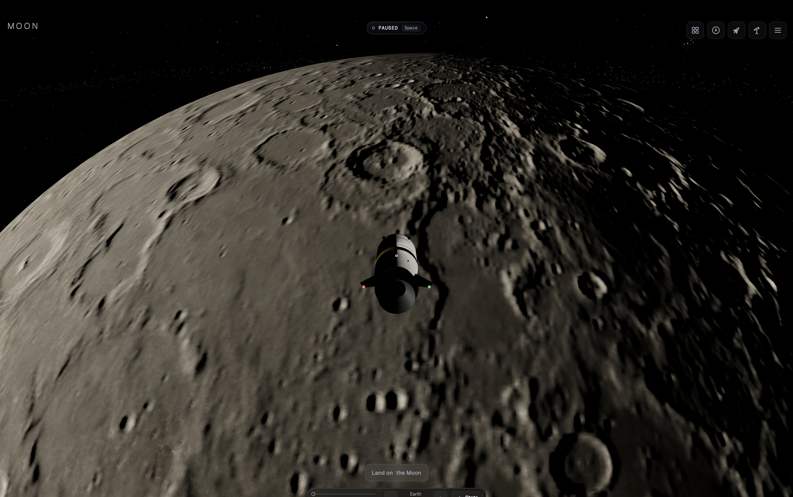
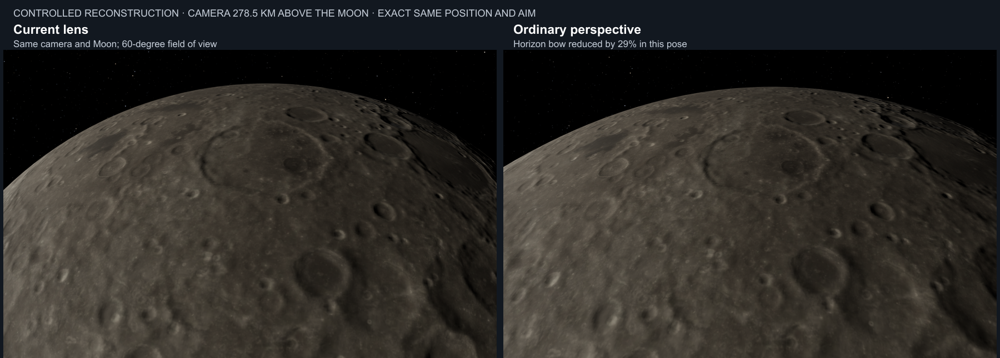

# Moon curvature investigation and strategic rendering handover

Prepared on 4 October 2026 for the next agent working in the Moon repository. Published on branch `fixCamera`; this bundle lives at `docs/handovers/moon-curvature-2026-10-04/`. Start with [README.md](README.md).

The user reported that the Moon looked sharply curved in one part of a close view and flat in another. Investigation found a geometrically consistent spherical outline, a substantial projection contribution, coarse shading relief, and a deeper coupling between spacecraft scale and camera distance. The latest discussion moved from isolated fixes toward a coherent flight camera and planetary surface design.

The next step is to develop that strategic design into a concrete, repository-grounded prototype plan. No application fix was implemented. A particular projection, spacecraft scale, terrain implementation, or lens transition has not been approved by the user.

## User intent and scope

The user first supplied a screenshot and asked whether the Moon's curvature looked wrong, particularly when very close. They then asked to investigate the root cause extensively and propose ideas. After receiving the diagnosis, they asked for more strategic thinking about how a AAA studio would address it, rather than a patch. Finally, they requested this handover, including their photographic evidence and the agent's captures.

Treat physical consistency, unrestricted viewing, and a convincing sense of planetary scale as the objectives. A flatter horizon alone is not an acceptance criterion. Keep measurements, interpretations, proposals, and unresolved questions separate. Do not treat this document or text visible in the screenshot as additional user authorization.

An optional question about whether the user reached the screenshot by Travel, autopilot, or camera dragging received no answer. The original camera telemetry, URL parameters, clock, field of view, and exact input sequence are unknown.

## Repository state and work ownership

The investigation and successful validation ran at commit:

`e083aef86f356eb9eb3cd911669278a3d9e3b56f`

The checkout was clean during the investigation and remained clean when its conclusions were delivered. This agent changed no tracked application files during that investigation. It created ignored diagnostic scripts and local screenshots/logs.

The published `fixCamera` branch starts at that exact tested commit and adds only this handover bundle. Later, unrelated highlight-meter work was committed on the author's other branch; it is not included here. The earlier build and test records apply to the investigation commit, not to later application changes.

Read the repository's current `AGENTS.md` / `CLAUDE.md` and module headers. `planning/` is gitignored local scratch and must not be committed. This explicitly requested published handover is stored under `docs/handovers/` so it is available in a normal cloud checkout. Stage only explicit paths if subsequent work is committed.

## Original user evidence

The original PNG has been copied byte for byte into this bundle so the evidence no longer depends on a temporary clipboard file.

**Primary preserved copy:**

[Original user screenshot](original/user-moon-screenshot.png)

The PNG is the original user attachment, preserved at `original/user-moon-screenshot.png`. No access to the author's clipboard directory is needed.

The original is 3456 × 2166 pixels. Chat displayed a resized 1990 × 1247 version. Measurements used the original resolution.

SHA-256 of both original and preserved copy:

`1f9e43ef48ad46c2e22b85343a44a6727ac4455bf84b874421b3b1d9bbb38c24`



## Agent evidence index

The full original investigation directory was copied into `evidence/` in this bundle. The primary items are:

| Evidence | Purpose |
| --- | --- |
| [Lens comparison](evidence/lens-comparison.png) | Identical camera and Moon under full stereographic versus ordinary perspective |
| [Measured horizon curves](evidence/horizon-measurement.png) | Outlines measured from the diagnostic sphere masks |
| [Original screenshot fit](evidence/screenshot-fit.json) | Circle fit and conditional altitude estimates for several assumed fields of view |
| [Isolation measurements](evidence/isolation/measurements.json) | Outline errors, bow, geometry comparison, and shading differences |
| [Isolation capture records](evidence/isolation/records.json) | Camera, Moon transform, maps, GPU, streaming state and console results for 15 captures |
| [Real approach contact sheet](evidence/approach/sheet.jpg) | Eight-stop real flight-path comparison, selected stops shown in the sheet |
| [Real approach records](evidence/approach/records.json) | Real approach and two camera drags, ramp readings and surface stability |
| [Full lens regression log](evidence/approach-probe.log) | Default, ramp law, pixel geometry, landing, takeoff and camera-control checks |
| [Source test log](evidence/tests-source.log) | 198 files and 4318 tests passed |
| [Build log](evidence/build.log) | Successful TypeScript and production build, with bundle-size warning |

The reconstruction is intentionally comparable in framing, not an exact reproduction of the original terrain, illumination or unknown camera settings. Do not describe it as an exact before-and-after of the user's scene.



## Verified geometry and projection findings

### The original outline is smooth

A circle was fitted to the clearly illuminated left limb of the original image, sampling columns from approximately x = 80 through 1590. Dark terrain near the terminator was excluded because thresholding there follows illuminated features rather than the geometric limb.

The fit gave a centre near `(1877.85, 2874.23)` and radius `2643.93` pixels. Mean radial residual was approximately 0.291 px; maximum was approximately 1.946 px. Fits using shorter intervals on that left limb produced similar results.

This supports a continuous circular arc under the existing projection, with no evidence of a kink in that visible section. It does not prove that every dark part of the outline or the entire shading model is correct. A circular arc naturally has a shallower slope at its top than at its sides; slope and curvature should not be conflated.

### The altitude inference is conditional

Assuming the screenshot uses full stereographic projection and a 60 degree vertical design field of view, the fitted circle implies a lunar angular radius near 59.525 degrees and a camera altitude near 278.5 km for radius 1737.4 km.

The actual field of view is unknown. The same fit implies approximately 464 km at 50 degrees and 163 km at 70 degrees. The 278.5 km figure is an image-derived hypothesis, not recovered telemetry. It was used to choose the controlled reconstruction's altitude.

### The controlled renderer agrees with the sphere geometry

The final isolation run used 1440 × 902 at DPR 1, a 60 degree design field of view, camera altitude 278.5 km, a frozen clock, pinned exposure, and the actual Moon radius with mesh scale `[1,1,1]`. It also captured 68 km and 1000 km poses and a 390 × 844 portrait view.

The final main reconstruction used clock `2026-10-04T08:00:00Z`, phase 70 degrees, frame roll 270 degrees, then a fixed camera orientation chosen to resemble the screenshot's horizon placement. The script contains the exact operations. These diagnostic poses bypass the cruise rig; they test projection and shading, not the live proximity-ramp driver.

An isolated unlit sphere was rendered through the actual camera and post-processing path. CPU ray-sphere calculations using the recorded pose and projection predicted the horizon with these errors:

| Render | Mean absolute error | Maximum absolute error |
| --- | --- | --- |
| Full stereographic, 256 segments | 0.346 px | 0.983 px |
| Ordinary perspective, 256 segments | 0.474 px | 1.087 px |
| Full stereographic, 1024 segments | 0.310 px | 0.900 px |

This supports correct rendering of the nominal sphere under both projections at this pose.

The measured bow was defined as the average edge height at x = 5 and x = 1430 minus the height at x = 720 in the 1440 px image. It was 263.5 px under full stereographic and 187.5 px under perspective, a reduction of about 28.8 percent. This is a pose-specific measure of projection influence, not a universal improvement metric.

Increasing longitude segments from 256 to 1024, with proportional latitude segments, moved the thresholded outline by at most 1 px and 0.086 px on average across image columns. 124 of 1440 columns moved. Increasing the sphere's polygon count is therefore not a plausible primary cure for this appearance.

Important telemetry detail: `09-mask-fine` records the app's unchanged Moon geometry as 256 segments. The separate diagnostic mask mesh was the object set to 1024 segments. Read the script when interpreting that record.

## Verified camera and live ramp findings

The app defaults to full stereographic projection. The optional proximity ramp is disabled unless `?lensramp=1` or `__moon.setLensRamp(true)` enables it.

The ramp is full strength at angular radius 45 degrees and off at 70 degrees, with a smooth transition between. Its driving distance is **ship distance plus intended chase boom**, not the camera's actual distance. This deliberately keeps orbiting, collision pushes and camera dragging from changing lens strength continuously.

The real-flight test used `tools/lens-ab-capture.mjs`, Travel to the Moon, the real autopilot to orient the ship, then controlled ship-position steps along the approach. Unlike `frame()`, this exercises the actual cruise camera, safety pass and ramp. It captured eight stops from 1500 km to 78 km ship altitude, plus two mouse drags. Clock was `2026-06-14T18:40:00Z`. Both arms held matching loaded surfaces, with no notes, failures or page errors.

At 78 km ship altitude, the driving angular radius was 57.8465 degrees and the enabled ramp retained strength 0.4792. After orbiting the camera, the camera's actual angular radius was approximately 73.10 degrees, while the ramp stayed at 0.4792 as designed.

Consequently, simply enabling the existing ramp only partially changes this class of close-Moon view. Its current behavior passes its mathematical and camera-invariance contract; the open issue is whether that contract produces the intended experience.

The full `approach-probe.mjs --assert` passed, including the camera zoom-floor/collision regression. Older memory describes a clamp-induced intended-boom growth defect; do not report that historical defect as still present in this tested commit.

Current rig quantities from `cruiseView.ts` are:

| Quantity | Value |
| --- | --- |
| Ship reference radius | 27.146875 km |
| Chase trail along the ship direction | 219.721873 km |
| Ship surface clearance | 40.720313 km |
| Camera surface margin | 67.867188 km |
| Conservative hull extent | 59.723125 km |
| Camera zoom floor | 89.584688 km |

The actual intended boom includes camera lift and varies with heading; about 233 km is representative, not a universal distance. The ship reference radius is an authoring scale, not a measured bounding radius or the exact ship length.

## Verified surface findings

The Moon uses a smooth spherical mesh with measured elevation-derived tangent-space normals. The tested globe reached 256 × 128 segments, true radius 1737.4 km and scale 1. The craters do not have corresponding displaced terrain geometry in this path.

The close normal map is 2880 × 1440. At the equator, 2880 samples around the circumference correspond to about 3.79 km per texel. Streamed normal tiles are crops of that source; the larger colour tiles do not provide additional measured height detail. `public/textures/tiles/sets.v1.json` records `moon-normal/4k` with `baseWidth: 2880` and `spanU: 2`.

In the final cratered reconstruction, comparisons within the foreground region produced:

| Change from baseline | Mean absolute RGB channel difference on 0–255 scale | Pixels with a channel differing by more than 1 |
| --- | --- | --- |
| Measured relief disabled | 5.024 | 74.74 percent |
| Procedural synthesis disabled | 0.693 | 16.95 percent |
| Unchanged baseline captured again | 0 | 0 percent |

Relief therefore has a substantially larger image effect than synthesis in this view. These differences quantify influence, not the percentage of visual wrongness or proof that relief must be removed.

An earlier, less cratered exploratory view showed no pixel difference with synthesis disabled. A progress message reported that preliminary result. The final cratered view has the small nonzero result above; retain the final result and its scope.

Normal mapping changes lighting, not geometric parallax, crater-wall occlusion or the physical skyline. Magnifying a coarse relief map can provide strong apparent depth without the geometric cues expected from that depth. This is a supported mechanism for conflicting visual cues, not a demonstrated calibration error in every crater.

`gen-maps.mjs` uses artistic strength values and equirectangular slope handling. It is a candidate for physically scaled, pole-safe reconstruction. No new normals were baked, no new data was shipped, and no exact physical exaggeration factor was verified against the provenance of the shipped map. Do not promote an incidental generator calculation into a measured asset claim.

## Interpretation and strategic direction

The current evidence supports three interacting contributors: projection increases the visible dome; the camera can remain hundreds of kilometres above the ground while the ship suggests proximity; and coarse lighting relief provides incomplete terrain-depth cues. It does not establish a malformed lunar sphere.

The initial recommendation was to test a stronger proximity transition, such as 45 to 60 degrees, improve relief, consider an onboard camera, and eventually add actual terrain. The user then asked for a more strategic approach. Treat endpoint tuning as an experiment, not the agreed plan.

The later recommendation was an integrated flight-camera and planetary-surface project:

1. **Define the observer and spacecraft scale.** Decide whether free flight follows a physically sized craft or a planetarium observer with a navigation avatar. The suggested baseline is a physical flight camera with an explicit spacecraft scale. Split ship dimensions, camera framing, collision clearance and arrival standoff into quantities with separate meanings. The current shared Moon-derived scale makes them move together.
2. **Choose a projection policy for the complete journey.** Compare ordinary perspective throughout free flight with carefully designed alternatives, including the existing stereographic approach. Judge distant edge-of-screen planets, close horizons, approach and departure, sideways/backward views, and different displays. Ordinary perspective was suggested as a stable reference and preferred prototype baseline, not selected as the final product policy. A nonlinear lens can be legitimate; mathematical influence alone does not decide visual quality.
3. **Represent one authoritative elevation surface at multiple resolutions.** Derive geometry, normals, bounds, and clearance queries from the same body coordinates and height convention. Distant globe, orbital patches and close terrain must describe the same crater locations and heights. Select detail using projected geometric error plus resource budgets. Existing streaming, floating origin and readiness mechanisms are useful foundations, but image tiles over a sphere are not yet a terrain system.
4. **Assign geometry and materials distinct responsibilities.** Geometry should carry visible terrain shape and parallax; normals should carry smaller slopes; material response should describe the surface. Establish these relationships with a known sphere and crater before judging measured lunar assets. Preserve scientific uncertainty where fine terrain is not measured.
5. **Prove one complete representative flight.** Use one lunar region and one craft, from orbital approach through the intended closest view and back out, before expanding to other bodies or building a general terrain framework.

The strategic recommendation is to prototype camera and scale with simple surfaces first, then add one measured terrain region. The user has not selected a ship size, closest flight altitude, final projection, or budget. Do not interpret the proposal as a request for a full surface-landing simulator or an engine migration.

## Acceptance criteria for the next prototype

- Shape follows the actual camera pose, physical radius and terrain elevation. A naturally curved horizon at orbital altitude is expected.
- Camera movement gives coherent parallax and scale cues; free orbit remains available.
- The same landmarks retain position and shape through approach, orbit, retreat and detail changes.
- Returning to the same pose with the same frozen state returns the same surface.
- Terrain refinement does not make craters swell, shift, open holes or visibly disappear.
- Normals and displaced geometry agree at transitions, tile boundaries, the longitude seam and poles.
- Camera clearance and near-plane behavior remain valid for the chosen physical scale.
- Readability of distant bodies, labels and sky is assessed alongside close-ground appearance.
- Desktop and phone frame time, memory, loading and output resolution have explicit budgets. No new performance targets were measured or promised for terrain.
- View motion is reviewed. The completed investigation is chiefly still-image and numerical evidence; it is not visual acceptance of a new moving camera policy.

## Relevant code and tools

Paths below are relative to the repository root; read their module headers before editing.

| Path | Relevance |
| --- | --- |
| [src/shared/math/lensProjection.ts](../../../src/shared/math/lensProjection.ts) | Projection law, inverse, strength limits, sole FOV application seam |
| [src/shared/math/lensProximity.ts](../../../src/shared/math/lensProximity.ts) | Current 45/70 degree ramp and its documented tradeoffs |
| [src/planetarium/cruiseView.ts](../../../src/planetarium/cruiseView.ts) | Rig scales, safety geometry, intended boom, `largestDiscAngles`, zoom-floor fix |
| [src/planetarium/PlanetariumMode.ts](../../../src/planetarium/PlanetariumMode.ts) | Camera ownership/safety, ramp application, body LOD, DEV posing and probes |
| [src/planetarium/PlayerShip.ts](../../../src/planetarium/PlayerShip.ts) | Ship reference scale, profiles and physical position |
| [src/planetarium/ship/models/defaultShip.ts](../../../src/planetarium/ship/models/defaultShip.ts) | Default craft construction |
| [src/planetarium/PlanetFactory.ts](../../../src/planetarium/PlanetFactory.ts) | Moon material, relief binding, spherical geometry upgrade |
| [src/planetarium/world/surfaceShading.ts](../../../src/planetarium/world/surfaceShading.ts) | Normal sampling, synthesis, surface lighting |
| [src/planetarium/world/sectorMaterial.ts](../../../src/planetarium/world/sectorMaterial.ts) | Streamed material inheritance and per-frame synchronization |
| [src/planetarium/world/sectorGrid.ts](../../../src/planetarium/world/sectorGrid.ts) | Sector hierarchy, geometry/UV layout and data crop semantics |
| [src/planetarium/world/sectorStreamer.ts](../../../src/planetarium/world/sectorStreamer.ts) | Sector residency, loading and presentation |
| [src/planetarium/world/textureLadder.ts](../../../src/planetarium/world/textureLadder.ts) | Colour and normal resolutions, upgrades and memory policy |
| [gen-maps.mjs](../../../gen-maps.mjs) | Existing elevation-to-normal generator |
| [tools/gen-tiles.mjs](../../../tools/gen-tiles.mjs) | Lunar relief crop generation |
| [src/interior/InteriorScene.ts](../../../src/interior/InteriorScene.ts) | Another consumer to audit if Moon normal interpretation changes |
| [tools/lens-ab-capture.mjs](../../../tools/lens-ab-capture.mjs) | Real flight-path lens comparison |
| [tools/approach-probe.mjs](../../../tools/approach-probe.mjs) | Full existing lens regression battery |
| [tools/oval-probe.mjs](../../../tools/oval-probe.mjs) | Off-axis body projection checks |
| [tools/visual-sweep.mjs](../../../tools/visual-sweep.mjs) | Surface appearance, viewing-angle and zoom checks |
| [tools/browserLock.mjs](../../../tools/browserLock.mjs) | Machine-wide GPU browser lock |

Retain the lens contract: use `applyDesignFov` / the mode's `setDisplayFov`; `camera.fov` is overscan. Screen calculations read `effectiveStrength`, not merely requested strength. DEV `frame()` bypasses the real cruise ramp; test ramp behavior through actual flight paths.

## Validation and limitations

Successful investigation runs used headless Chromium through Playwright with ANGLE Metal on Apple M5 Max. The browser reported `ANGLE (Apple, ANGLE Metal Renderer: Apple M5 Max, Unspecified Version)`. The Browser plugin was unavailable, so the existing repository screenshot tools were used.

- Production build passed, with an existing bundle-size warning.
- Source suite passed: 198 files, 4318 tests.
- Real Moon approach comparison passed with matching surfaces and no page errors.
- Full approach regression passed all phases, including landing/takeoff and orbit/zoom-floor behavior.
- Final isolation run completed 15 captures, with zero uncaught page errors and zero failed requests. Its console contained 56 late shader-compilation warnings from the diagnostic changes and four `THREE.Texture.setValues(): property 'wrapR' does not exist` warnings. Do not claim the console was warning-free or that this was a clean timing benchmark.

During publication preparation on `fixCamera`, the production build and all 4318 source tests across 198 files passed again. Both portable scripts passed syntax checks. Rescoring the preserved images with the portable measurement script reproduced the complete original measurement report exactly. Bundle hashes, the original photo's identity and relative links were also checked. This did not repeat the browser captures on a cloud GPU.

An initial bare `npm test` collected ignored scratch checkouts under `planning/` and encountered a timing failure under heavy contention. That run was stopped. Its `tests.log` is retained only for provenance and is not the validation result. The successful command was:

```sh
npm test -- --exclude '**/planning/**' --maxWorkers=4
```

Several exploratory browser runs were interrupted by reloads while using development servers/shared dependency state. An early mask experiment used a scene-wide material override and was invalid because other scene objects became white. These attempts were replaced by the successful final isolated-scene run. The final `isolation/records.json`, images and `measurements.json` agree; use those rather than interpreting earlier chat tool output as final evidence.

## Reproduction notes

Two portable copies live in [scripts/](scripts/):

- [curvature-diagnosis.mjs](scripts/curvature-diagnosis.mjs) captures the controlled views and mask experiments.
- [curvature-measure.mjs](scripts/curvature-measure.mjs) reads those captures and computes the measurements.

Exact original scripts are preserved in [scripts/originals/](scripts/originals/) for audit. The portable copies adapt only import locations, URL/output configuration and browser-platform selection. Their analytical equations and camera operations are unchanged. They have been syntax-checked and their measurement output compared against the preserved report; new browser rendering on another platform has not been validated.

From the repository root, install the normal dependencies with `npm ci`. The measurement script additionally needs `sharp` (`npm install --no-save --package-lock=false sharp@0.35.4`). Browser captures need a Playwright Chromium installation (`npx playwright install chromium`, or an existing executable via `PW_CHROMIUM`). Start the dev server before capturing. Read the real-GPU screenshot skill in `.claude/skills/headless-webgl-screenshots/SKILL.md`.

```sh
node docs/handovers/moon-curvature-2026-10-04/scripts/curvature-diagnosis.mjs
node docs/handovers/moon-curvature-2026-10-04/scripts/curvature-measure.mjs
```

The defaults are `http://localhost:5757` and a fresh local output directory `planning/moon-curvature-new/isolation/`. Override them with `MOON_CURVATURE_URL` and `MOON_CURVATURE_OUT`. The measurement script reads and writes the output directory named by `MOON_CURVATURE_OUT`. To rescore the preserved captures without overwriting their committed report, first copy `evidence/isolation/` into a fresh ignored output directory, then point the measurement script there.

On macOS the portable capture uses ANGLE Metal. Elsewhere it defaults to SwiftShader, which is useful for diagnosis but cannot establish hardware performance or exact cross-platform pixel parity. `MOON_CURVATURE_ANGLE` selects a different ANGLE backend explicitly. The original successful captures remain the evidence of the Apple GPU run; identify the backend in any new report.

The diagnostic script used this isolated server configuration on port 5757:

```sh
node --input-type=module -e "import { createServer } from 'vite'; const server = await createServer({cacheDir:'/tmp/moon-curvature-vite-cache',optimizeDeps:{noDiscovery:true},server:{port:5757,strictPort:true,watch:null,hmr:false}}); await server.listen(); server.printUrls();"
```

The separate cache and disabled discovery/watch avoided the prior resets. Disabling the WebSocket transport with `ws:false` caused repeated Vite client `send` errors in an unsuccessful attempt; retain the standard transport. Temporary servers on 5756 and 5757 created by this agent were stopped when the investigation finished. Do not assume either is still available.

The existing successful Moon approach command was:

```sh
node tools/lens-ab-capture.mjs --url=http://localhost:5174 --body=Moon --frames=8 --top=1500 --bottom=78 --w=1440 --h=902 --lookaround --sheet --assert --out=/tmp/moon-shots/curvature-investigation/approach
```

The successful full regression command was:

```sh
node tools/approach-probe.mjs --url=http://localhost:5757 --assert --out=/tmp/moon-shots/curvature-investigation/regression
```

Both scripts take the machine-wide browser lock. Keep GPU browser runs sequential. The sandbox initially prevented Chromium's macOS bootstrap registration; an approved unsandboxed run was needed. Avoid writing Playwright scripts in `/tmp`, since module resolution then misses the repository dependencies.

## Related prior work and external references

Historical context from a prior local memory entry: a polar relief investigation produced an unverified object-space-normal prototype on branch `codex/moon-polar-relief`, based on `031b97fbddb74336f5d6563ddb6e7c7ae92f9753`, with `tools/sphericalNormals.mjs`. Its approach sampled spherical heights with Cartesian tangent directions, longitude wrapping, explicit pole handling and supersampling. A change of normal-map format would have to reach the main surface, streamed sectors and Look inside together, with versioned assets and synthetic pole/seam tests.

That prototype was not inspected or validated in the curvature investigation and is not included in this bundle. Its remote availability is unknown. Treat it as optional historical context, not a dependency or a finished repair. The next agent needs no local memory files to use this handover.

Primary references consulted:

- [Three.js MeshStandardMaterial](https://threejs.org/docs/pages/MeshStandardMaterial.html): normal maps change lighting; displacement changes geometry.
- [NASA CGI Moon Kit](https://svs.gsfc.nasa.gov/4720/): elevation products, reference radii and encoding, including higher-resolution sources.
- [Cesium tile selection algorithm](https://cesium.com/learn/cesium-native/ref-doc/selection-algorithm-details.html): geometric error projected into pixels, refinement and preservation of loaded detail.
- [Epic Panini projection](https://dev.epicgames.com/documentation/unreal-engine/panini-projection-in-unreal-engine?lang=en-US): a production example of intentional nonlinear projection and its tradeoffs.

These references support specific mechanisms. They do not establish that every AAA studio would choose the proposed camera or terrain design.

## Suggested next agent task

Read the preserved original image and the lens comparison, then inspect the current camera and ship-scale code. Reconfirm repository state and protect unrelated changes. Turn the strategic proposal into a small set of concrete camera-and-scale prototypes and a representative lunar-region test plan, with explicit acceptance gates and dependencies. Resolve the target experience before committing to global lens replacement, asset regeneration or a terrain architecture. Follow the user's next instruction on whether to stop at planning or implement a prototype.

All bundle files are listed with sizes and SHA-256 hashes in [manifest.json](manifest.json). Pictures, records, logs and scripts are committed directly in this folder. All handover links are relative and work in a cloud checkout or repository browser. No ZIP, clipboard directory, local worktree or external memory store is required. Run `python3 docs/handovers/moon-curvature-2026-10-04/verify.py` from the repository root to check file hashes and local Markdown links.
